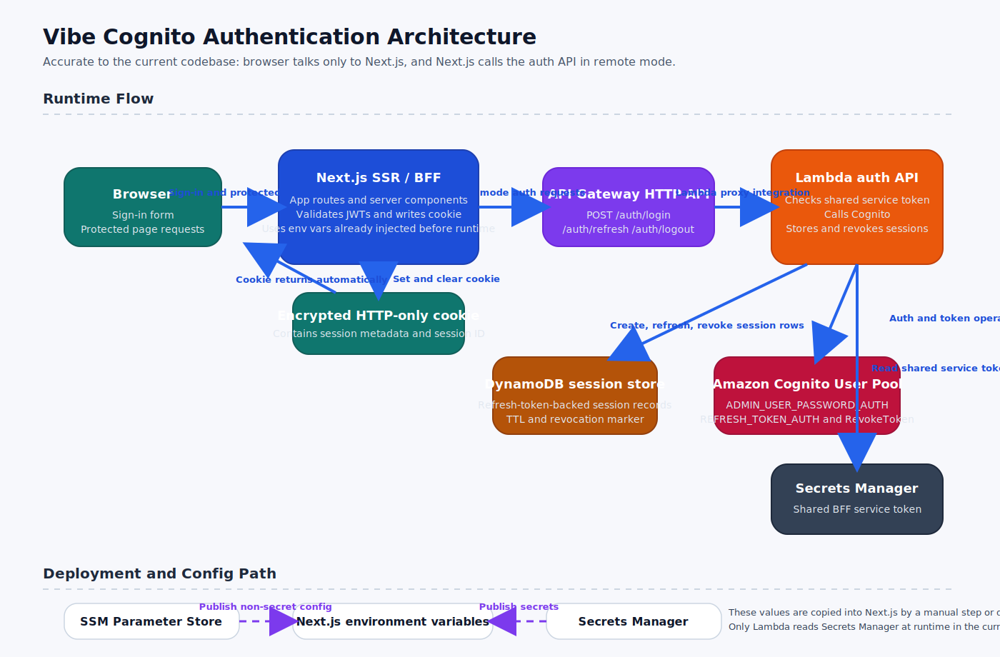

# Cognito Auth

## Architecture

The authentication flow is intentionally server-centric:

- `Next.js` acts as the backend-for-frontend and owns the browser session.
- The browser never stores auth state in `localStorage`.
- The app sets one encrypted HTTP-only cookie that contains only session metadata and a server session ID.
- `Next.js` talks to the serverless auth API over a shared service token.
- The auth API uses `Cognito` for password authentication and refresh.
- `DynamoDB` stores refresh-token-backed session records keyed by session ID.
- `Secrets Manager` stores the shared BFF-to-auth-API token and the Next session secret.
- `SSM Parameter Store` publishes the non-secret values that can be copied into the Next app environment after deploy.



Diagram note:
- `Browser` never calls `API Gateway` directly in the current design.
- `Next.js` does not read `SSM` or `Secrets Manager` directly during a user request.
- Only the auth `Lambda` reads `Secrets Manager` at runtime, and it does so only for the shared service token.
- The Next app reads `process.env` at runtime. Those values are currently injected by a manual step or by a deployment pipeline outside this repo.

The implementation uses the direct Cognito auth API instead of Hosted UI.

Why:

- It keeps the login experience first-party inside the Next app.
- It fits the BFF pattern cleanly because the browser only talks to Next.
- Passwords are still only verified by Cognito and are never stored by the app.

If you later need social login, enterprise federation, or OAuth consent flows, Hosted UI is the right next step.

## Runtime Request Flow

### Login

1. The browser submits the sign-in form to `Next.js`, not to `API Gateway`.
2. The route handler in `app/api/auth/login/route.ts` validates the request and calls `getAuthProvider().signIn(...)`.
3. In `remote` mode, `lib/auth/provider.ts` sends a server-to-server `POST` request to:

```text
AUTH_API_BASE_URL/auth/login
```

4. That request includes the shared header:

```text
x-auth-service-token
```

5. `API Gateway` routes the request to the single auth `Lambda`.
6. The `Lambda` loads the expected service token from `Secrets Manager`, compares it with the request header, and rejects the call if they do not match.
7. The `Lambda` calls `Cognito` with `AdminInitiateAuth` using `ADMIN_USER_PASSWORD_AUTH`.
8. `Cognito` returns `access token`, `id token`, and `refresh token`.
9. The `Lambda` creates a `sessionId` and stores a session record in `DynamoDB`. That record contains the `refreshToken` and small session metadata.
10. The `Lambda` returns the token payload to `Next.js`.
11. `Next.js` verifies the returned JWTs against the configured `issuer` and `JWKS URI`.
12. `Next.js` then writes one encrypted HTTP-only cookie back to the browser. The cookie contains session metadata and the `sessionId`, not the raw refresh token.

### Refresh

1. `Next.js` reads and decrypts the session cookie.
2. If the access token is near expiry, `Next.js` calls `/api/auth/refresh`.
3. The refresh route sends the `sessionId` to the auth API.
4. The `Lambda` loads the matching session record from `DynamoDB`.
5. The `Lambda` uses the stored `refreshToken` to call `Cognito` with `REFRESH_TOKEN_AUTH`.
6. `Cognito` returns new access tokens.
7. `Next.js` verifies those tokens again and rewrites the encrypted cookie.

### Logout

1. `Next.js` reads `sessionId` from the cookie.
2. It calls the auth API logout route.
3. The `Lambda` loads the stored session, calls `Cognito RevokeToken`, and marks the session as revoked in `DynamoDB`.
4. `Next.js` clears the browser cookie.

## Data Ownership

- `Cognito` owns password verification, token signing, refresh, and token revocation.
- `DynamoDB` owns the app session store:
  - `sessionId`
  - `refreshToken`
  - minimal user snapshot
  - TTL and revoked state
- `Secrets Manager` owns:
  - `api-service-token`
  - `next-session-secret`
- `SSM Parameter Store` publishes non-secret config such as:
  - auth API base URL
  - user pool ID
  - user pool client ID
  - issuer
  - JWKS URI

## Config Resolution

There are two different patterns in the current implementation.

### Lambda auth API

- The `Lambda` receives non-secret config directly through its `environment` block in the CDK stack.
- Example values:
  - `COGNITO_USER_POOL_ID`
  - `COGNITO_USER_POOL_CLIENT_ID`
  - `SESSION_TABLE_NAME`
  - `SERVICE_TOKEN_SECRET_ARN`
- The `Lambda` then reads the actual `api-service-token` value from `Secrets Manager` at runtime.

### Next.js app

- `Next.js` reads auth config only from `process.env` through `lib/auth/config.ts`.
- The current codebase does not fetch `SSM` or `Secrets Manager` directly from the Next runtime.
- After infrastructure deploy, someone still needs to copy or inject the values into:
  - local `.env.local`
  - Vercel environment variables
  - another deployment target

This means the infrastructure stack is complete, but app deployment and env injection still require a separate process.

## Local Run

1. Copy `.env.example` values into `.env.local`.
2. Fill in the Cognito and auth API values from AWS:

- `AUTH_SESSION_SECRET` from `Secrets Manager`
- `AUTH_API_SERVICE_TOKEN` from `Secrets Manager`
- `AUTH_API_BASE_URL` from `SSM Parameter Store`
- `COGNITO_USER_POOL_ID` from `SSM Parameter Store`
- `COGNITO_USER_POOL_CLIENT_ID` from `SSM Parameter Store`
- `COGNITO_ISSUER` from `SSM Parameter Store`
- `COGNITO_JWKS_URI` from `SSM Parameter Store`

3. Start the app:

```bash
npm run dev
```

4. Open `http://localhost:3434/sign-in`.
5. Sign in with a real Cognito user.
6. Confirm that:

- `/protected` redirects to `/sign-in` when signed out
- sign-in sets the cookie and renders `/protected`
- `/api/protected/profile` returns `401` when signed out and a user payload when signed in
- logout clears the cookie

## Validation Commands

Run the local validation loop with:

```bash
npx tsc --noEmit
npm test
npm run cdk:synth
```

## CDK Stack

The CDK stack entrypoint is:

```bash
infra/bin/auth-app.ts
```

Synth uses:

```bash
npm run cdk:synth
```

The stack provisions:

- Cognito user pool
- Cognito app client for server-side auth
- API Gateway HTTP API
- Lambda auth handler
- DynamoDB session table with TTL
- Lambda IAM permissions for Cognito, DynamoDB, and Secrets Manager
- CloudWatch log group for the auth Lambda
- SSM parameters for runtime discovery and deployment lookup
- Secrets Manager secrets for the BFF service token and Next session secret

## Runtime Env Mapping

For deployed Next.js environments, set:

- `AUTH_MODE=remote` or `AUTH_MODE=disabled`
- `APP_BASE_URL`
- `AUTH_SESSION_SECRET`
- `AUTH_API_BASE_URL`
- `AUTH_API_SERVICE_TOKEN`
- `COGNITO_AWS_REGION`
- `COGNITO_USER_POOL_ID`
- `COGNITO_USER_POOL_CLIENT_ID`
- `COGNITO_ISSUER`
- `COGNITO_JWKS_URI`

The CDK stack publishes the non-secret values into SSM and the secret ARNs into SSM as references.
Those values are then copied into the deployed Next.js environment. The current runtime code does not fetch SSM or Secrets Manager directly during a user request.

## Cost Control And Public Access

### Pause the app-level auth flow

Set `AUTH_MODE=disabled` in `.env.local` or in your deployment target, then redeploy the Next.js app.

When auth is disabled:

- the sign-in form is hidden
- the header and home page stop rendering sign-in and protected links
- protected pages redirect back to `/sign-in` with a disabled reason
- login and refresh routes stop calling the upstream auth API

This is the smoothest way to pause auth without deleting AWS resources.

### Restrict the public entry point

If you want the auth API itself to stop accepting traffic over its default public URL:

1. Open `API Gateway`
2. Open the HTTP API created by this stack
3. Open API details
4. Disable the default `execute-api` endpoint

Important:

- this blocks `AUTH_API_BASE_URL` if it still points to the default `execute-api` hostname
- do this only if auth should be fully offline, or if you already have a custom domain for the API

### Remove Secrets Manager storage cost

If you want to remove the recurring storage cost from `Secrets Manager`, you can delete:

- `vibe/auth/api-service-token`
- `vibe/auth/next-session-secret`

Important:

- after deleting those secrets, the current remote auth setup will no longer work
- if you later want auth back, you will need to run `cdk deploy` again so the secrets are recreated
- once recreated, copy the new secret values into your deployment target again, such as Vercel env vars

### What this does not pause

These controls do not automatically remove every AWS cost:

- `Secrets Manager` stops costing only if you actually delete the secrets
- `DynamoDB` can still cost for stored data and PITR while the table exists
- `API Gateway`, `Lambda`, and `Cognito` usually only add meaningful cost when they are used

## Manual AWS Setup

These steps are still manual by design:

1. Bootstrap CDK in the target account if it has not been bootstrapped yet.
2. Deploy the stack:

```bash
npx cdk deploy
```

3. Create at least one Cognito user because self sign-up is disabled.
4. Set a permanent password for that user.
5. Retrieve the generated service token secret and Next session secret from Secrets Manager.
6. Retrieve the non-secret values from SSM Parameter Store.
7. Inject those SSM/Secrets values into your Next.js environment:
   - local `.env.local`
   - Vercel project env vars
   - or another deployment target
8. Serve the Next app over HTTPS and set `AUTH_COOKIE_SECURE=true`.

## Limitations

- The direct auth API path is great for BFF flows, but Hosted UI is a better fit if you need third-party identity providers.
- The DynamoDB session record stores the Cognito refresh token encrypted at rest by DynamoDB, but not application-level encrypted. Add envelope encryption if your compliance model requires it.
